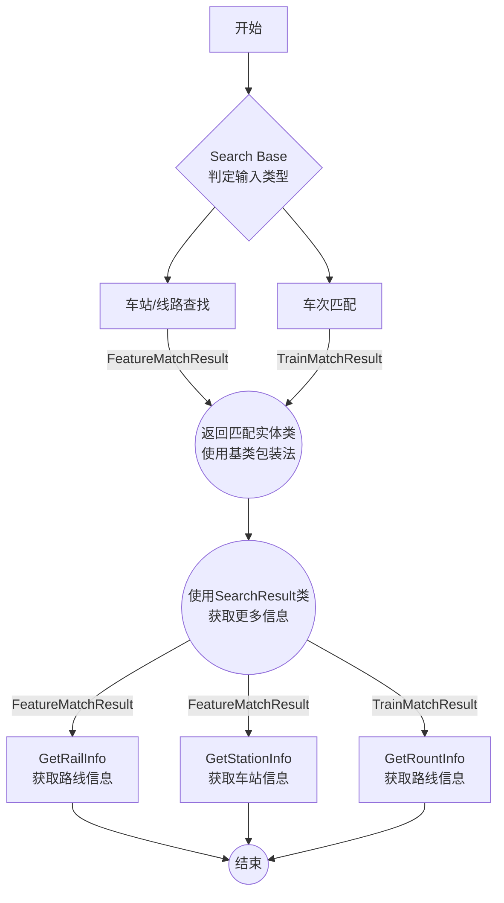

# Meow.TrainRadar
## 基于 cnrail.geogv.org 的铁路搜索系统 (API+)


[](https://github.com/DavidSciMeow/PowerfulMeowLibrary/actions/workflows/TrainRadar.yml)

# 0. 引言
本库为铁路基础标准功能库,含有`铁路路线获取`,`铁路列车查询`,`列车路线查询`,`火车站查询`等功能  
本库目前`ToString()`模式不全, 还在修补, 不过属性和返回值完整, 完全可以调用使用  
```
@copy 
{ 
    cnrail.geogv.org
    LittleSciMeow(Electronicute) 
    2022 oct 26.
}
```

---

## 目录
> 1. 概述  
>> 1.1 文件组织概述  
>> 1.2 工作流程概述  
>> 1.3 建议查询逻辑  

>2. 内函数一览  
>> 2.1 类内函数实现  

>3. 计划更新内容  

---


# 1. 概述
## 1.1 文件组织概述

### 枚举列文件 publicEnums.cs 
(负责一切可知的枚举类型,包括以下类型)
> RailSpdType (铁路速度类型)  
> RailServiceType (列车类型)  
> StationType (车站类型)  
> ServiceType (服务类型)  
> LangPref (语言枚举)  
> SearchType (搜索类型)  

### 结构定义类 publicStructs.cs
(负责一切可知的结构类型,包括以下类型)
> *Struct* RailInfo (铁路信息)  
> *Struct* RouteStops (经停站类)  
> *Struct* RailDiagram (路线图)  
> *Struct* REndPoint (轨道节点)  
> *Struct* REndPointInner (REP内部结构)  
> *Struct* BureauInfo (铁路管理局信息)  
> *Struct* StationInfo (火车站信息)  
> *Struct* RouteInfo (运行路线信息)  

### 底文件 UrlBase.cs
(负责和API交互逻辑,转义API返回值到C#类等)
> ***class*** Search (查找模式基类)  
> ***class*** SearchResult (搜索结果)  
> ***class*** FeatureMatchResult (车站,线路查找结果)  
> ***class*** TrainMatchResult (车次匹配结果)  

> ***Static class*** SearchBase (搜索层固定逻辑)  
> ***Static class*** TRGet (静态获取)  

## 1.2 调用流程概述


## 1.3 简易查询逻辑
```csharp
//...Main(string[] args)
{
    SearchBase.Lang = LangPref.zhcn; // 设置返回语言
    while (true)
    {
        TrainSearchConsole();
    }
}
```
<details>
    <summary><h2 style="display:inline">点击展开查看TrainSearchConsole()函数</h2></summary>
    <pre><code>
public static void TrainSearchConsole()
{
    Console.Write("\n输入待查字符 (按 Ctrl-C 退出):");
    var s = Console.ReadLine();
    var d = new Search(s);
    if (d.HaveValue)
    {
        if (d.Data is FeatureMatchResult[])
        {
            FeatureMatchResult[] array = (FeatureMatchResult[])d.Data;
            for (int i = 0; i < array.Length; i++)
            {
                FeatureMatchResult a = array[i];
                Console.WriteLine($"[{i}] {a}");
            }
            Console.Write("-- 选择一项 (输入 -1 取消):");
            var ss = Console.ReadLine();
            if (int.TryParse(ss, out var ii))
            {
                if(ii == -1){ }
                else if (ii < 0 || ii >= array.Length) 
                {
                    Console.WriteLine("输入项目不在列表内");
                }
                else
                {
                    FeatureMatchResult a = array[ii];
                    if(a.Type == SearchType.STATION)
                    {
                        Console.WriteLine(a.GetStationInfo()?.ToString());
                    }
                    else if(a.Type == SearchType.RAIL)
                    {
                        Console.WriteLine(a.GetRailInfo()?.ToString()); 
                    }
                }
            }
            else
            {
                Console.WriteLine($"输入 {ii} 非数字");
            }
        }
        else
        {
            TrainMatchResult[] array = (TrainMatchResult[])d.Data;
            for (int i = 0; i < array.Length; i++)
            {
                TrainMatchResult a = array[i];
                Console.WriteLine($"[{i}] {a}");
            }
            Console.Write("-- 选择一项 (输入 -1 取消):");
            var ss = Console.ReadLine();
            if (int.TryParse(ss, out var ii))
            {
                if (ii == -1) { }
                else if (ii < 0 || ii >= array.Length)
                {
                    Console.WriteLine("输入项目不在列表内");
                }
                else
                {
                    TrainMatchResult a = array[ii];
                    Console.WriteLine(a.GetRouteInfo()?.ToString());
                }
            }
            else
            {
                Console.WriteLine($"输入 {ii} 非数字");
            }
        }
    }
    else
    {
        Console.WriteLine("搜索无结果");
    }
    Console.WriteLine();
}
    </code></pre>
</details>

# 2. 内函数一览
## 2.1 类内函数实现
### 更多实现细节请在VS调用时查看
> 枚举类 `没有`实现 内函数  

> RailInfo / StationInfo / RouteInfo  
> `o# ToString()` 重写的字符串输出  

> BereauInfo / REndPointInner / REndPoint / RailDiagram / RouteStops  
> ***`Struct`*** `(默认)`实现了自己的`构造函数`  

> Search / SeaerchResult  
> ***`Class`*** 实现了`构造函数`

> FeatureMatchResult  
> `o# ToString()` 重写的字符串输出  
> `- JObject GetInfo()` 内部的处理逻辑  
> `+ RailInfo? GetRailInfo()` 用于获取路线信息(如果返回Feature是路线)  
> `+ StationInfo? GetStationInfo()` 用于获取车站信息(如果返回Feature是车站)   

> TrainMatchResult  
> `o# ToString()` 重写的字符串输出  
> `+ RouteInfo? GetRouteInfo()` 用于获取本车的路线信息 

> TRGet  
> `+s FeatureMatchResult[] Feature(string)` 查找与形参相符的车站或路线  
> `+s TrainMatchResult[] Train(string)` 查找与形参相符的车次  

> SearchBase  
> `-s Langprefset()` 用于给请求头添加语言数据  
> `+s GetMatchFeature(string)` 查找车站路线的请求  
> `+s GetMatchTrain(string)` 查找符合的火车  
> `+s GetSpecificTrainRoute(string)` 查找特定火车的路线  
> `+s GetSpecificTrainStation(string)` 查找特定车站  
> `+s GetSpecificRail(string)` 查找特定路线  

# 3. 计划更新内容
>1. 绘制路线图并输出png/base64等
>1. 保存图像类存储结果